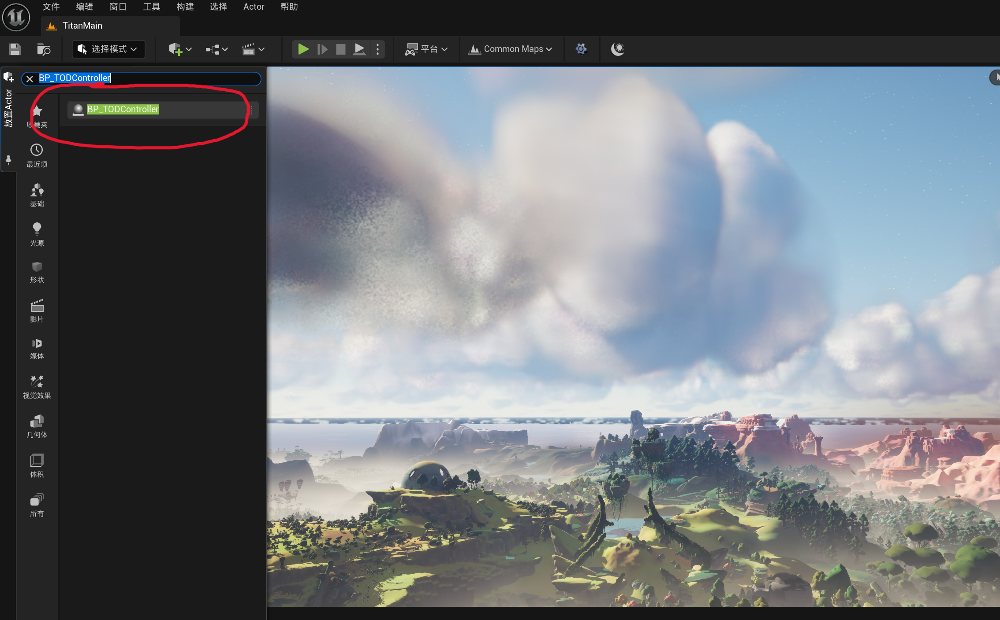
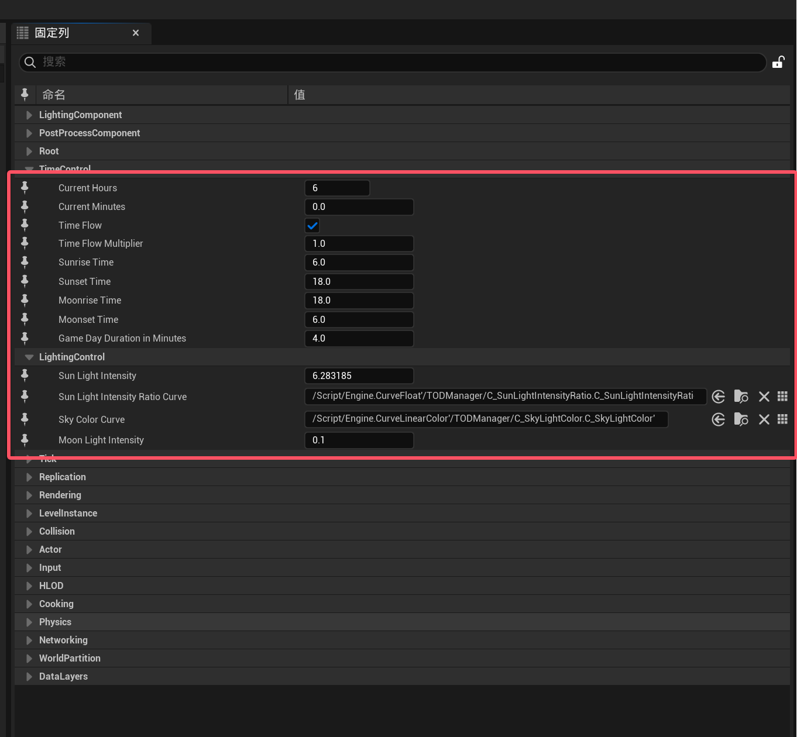
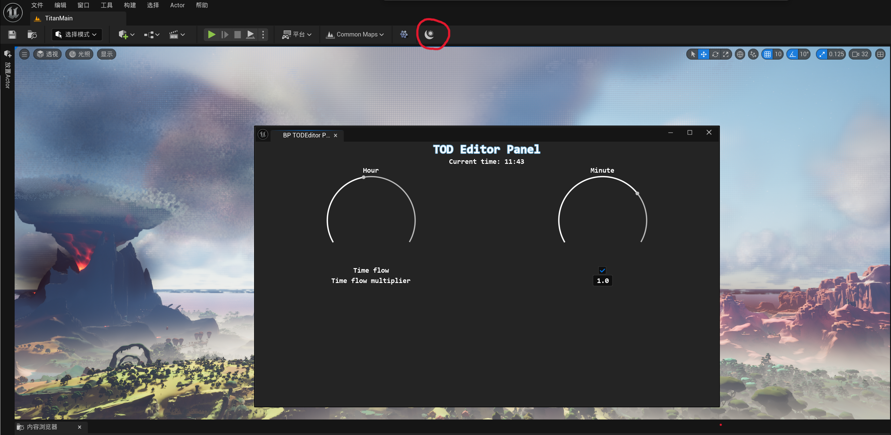

# TOD Manager Plugin for Unreal Engine

## Usage

1. Place `BP_TODContorller` into world
   

2. Configuration your prefer TOD settings
   
3. Open Editor Panel to control time of day for preview
   

4. Enjoy TOD in your project

   